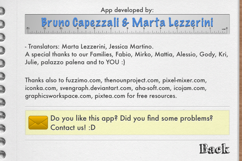
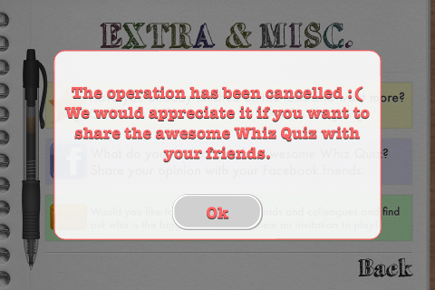

CCLabelTTFExtended
==================

Extension of the CCLabelTTF class for Cocos2d-iPhone 2.x
The CCLabelTTFExtended supports:
- Font autosizing functionality (with fixed label size). 
- Cool shadow effect

How to use it
---------
```objective-c
CGSize winSize = [CCDirector sharedDirector].winSize;
int padding = 10;
CCLabelTTFExtended *lblSubTitle =
[CCLabelTTFExtended labelExtendedWithString:@"Very long string"
                                 dimensions:CGSizeMake(winSize.width-padding*2, winSize.height*0.3f)
                                  alignment:kCCTextAlignmentCenter
                              vertAlignment:kCCVerticalTextAlignmentCenter
                              lineBreakMode:kCCLineBreakModeWordWrap
                                   fontName:@"Arial"
                                   fontSize:14];
    
[lblSubTitle customizeLikeAppleDefault];
[self addChild:lblSubTitle];
```

Some screens
---------



